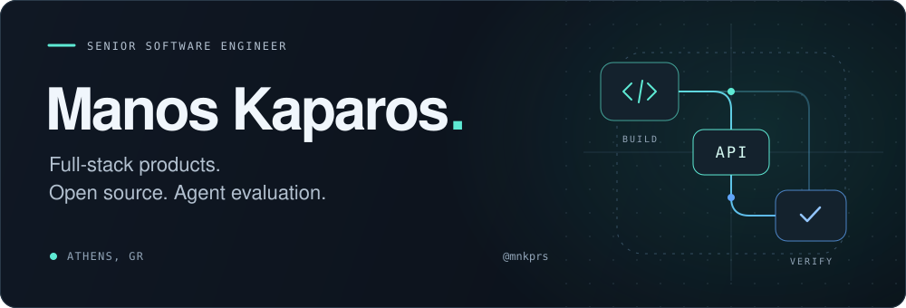

<picture>
  <source media="(prefers-color-scheme: dark)" srcset="./assets/banner-dark.svg">
  <source media="(prefers-color-scheme: light)" srcset="./assets/banner-light.svg">
  
</picture>

  <a href="#selected-work">Selected work</a> &nbsp; / &nbsp;
  <a href="#open-source">Open source</a> &nbsp; / &nbsp;
  <a href="#expertise">Expertise</a>

I'm **Manos**, a senior software engineer based in **Athens, Greece**. I build full-stack products and tools for evaluating coding agents. My work spans Angular and React interfaces, Node.js backends but I am open in any challenging opportunities regarding latest technologies.

## Selected work

<table>
<tr>
<td width="100%" valign="top">

### [fairtask ↗](https://github.com/mnkprs/fairtask)

**Can a coding task be graded fairly?**

An agent pipeline that screens SWE-bench-style tasks for unclear requirements and overly restrictive tests. It checks cited evidence against the source and compares verdicts with public human annotations.

Includes reproducible evaluations, readable agent traces, and installable agent skills.

TypeScript · Claude Agent SDK · Evaluation design

</td>
</tr>
</table>

## Open source

My latest upstream pull requests, newest first, with live status badges:

| Project | Contribution | Status |
| :--- | :--- | :--- |
| **[Effect](https://github.com/Effect-TS/effect)** | Fail an active multipart file part when the request body stream errors, instead of hanging until the consumer times out. |  |
| **[UnoCSS](https://github.com/unocss/unocss)** | Applies stacked variants left to right in preset-wind4, matching Tailwind v4, behind a new `variantApplyOrder` option. |  |
| **[Spartan](https://github.com/spartan-ng/spartan)** | Keep a dialog's disableClose and closeOnOutsidePointerEvents inputs live while it is open, so unsaved-changes guards can block Escape and backdrop dismissal. |  |
| **[Storybook](https://github.com/storybookjs/storybook)** | Remove comment lines from the docs' shell snippets so the Copy button copies only runnable commands. |  |
| **[Spartan](https://github.com/spartan-ng/spartan)** | Add browser regression coverage for Escape dismissal of nested popovers with tooltips. |  |

[Explore my upstream pull requests →](https://github.com/search?q=is%3Apr+author%3Amnkprs+-user%3Amnkprs&type=pullrequests)

## Expertise

| Area | What I work with |
| :--- | :--- |
| **Frontend & mobile** | TypeScript, Angular, React, Next.js, Capacitor, component behavior and state management |
| **Backend & data** | Node.js, NestJS, PostgreSQL / Supabase, Redis, APIs, payment flows and concurrency |
| **Agents & evaluations** | Agent orchestration, SWE-bench-style task screening, evidence verification, error analysis and reproducible experiments |
| **Testing & delivery** | Playwright, Vitest, regression testing, GitHub Actions, mobile release pipelines |
| **Smart contracts** | Solidity, Foundry, Base, contract integration and transaction receipts |

---

  Athens, Greece &nbsp; · &nbsp; <a href="https://github.com/mnkprs?tab=repositories">Explore my repositories</a>

